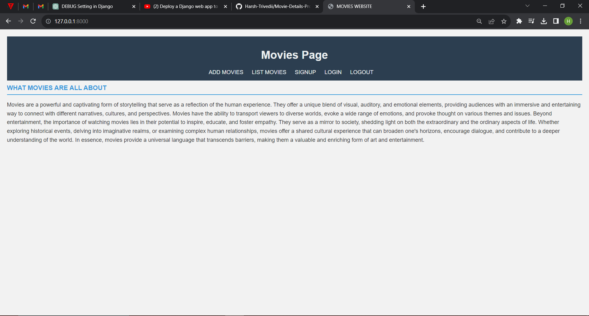
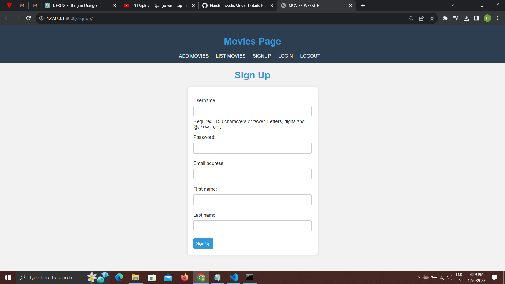
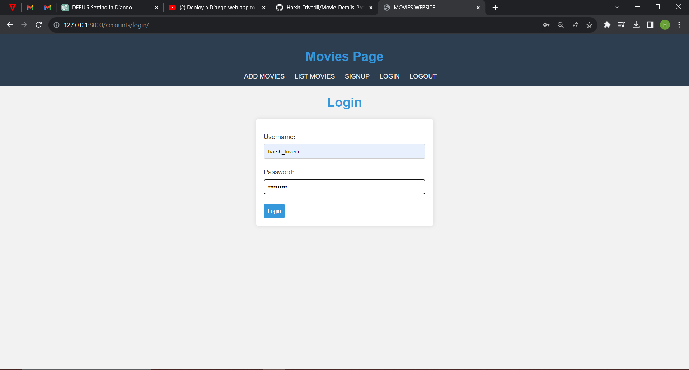
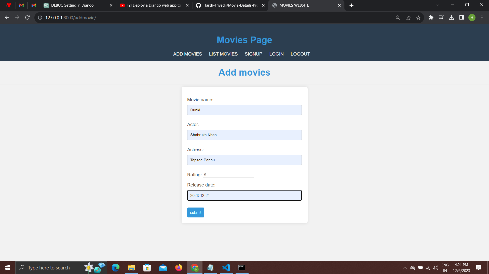
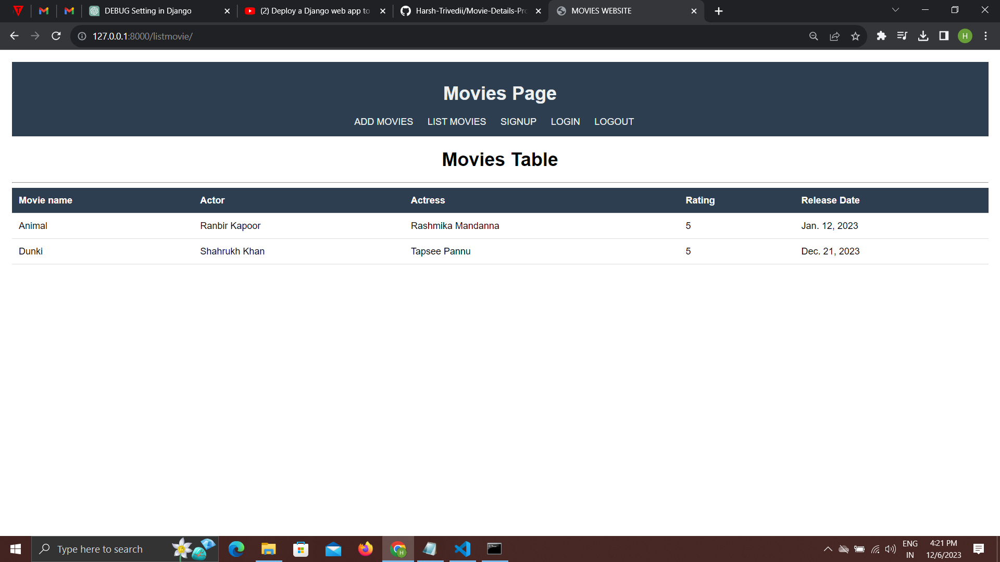

🎬 Movie Details Project

Welcome to the Movie Details Project! This Django project allows you to perform CRUD operations on movie details.

🌟 Features

- 🛡️ User Authentication: Users can register, log in, and manage their movie details.
- 📝 ModelForm: Utilizes Django ModelForms for easy form handling.
- 🖼️ Templates and Static Files: Uses HTML templates and CSS for a clean and responsive UI.
- 🔄 Template Inheritance: Implements template inheritance for consistent page layouts.
- 🗃️ Database CRUD Operations: Performs Create, Read, Update, and Delete operations on movie details.
- ✅ Form Validations: Includes form validations for data integrity.
- 🏷️ Template Tags: Uses Django template tags for dynamic content rendering.

🚀 Technologies Used

- Frontend: HTML, CSS
- Backend: Django v4.2.4

## 🚦 Getting Started

1. Clone the repository.
   ```bash
   git clone <repository_url>
   cd movie-details-project

2. Install dependencies- 
pip install -r requirements.txt

3. Apply migrations and run the server- 
- python manage.py migrate
- python manage.py runserver

4. Visit http://localhost:8000/ in your browser. Your webpage will look like this-

   Main Page-
   

   Signup Page-
   

   Login Page-
   

   AddMovies Page-
   

   List Movies Page-
   
   
   
